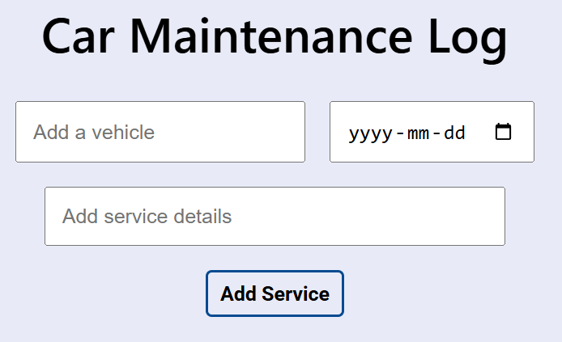
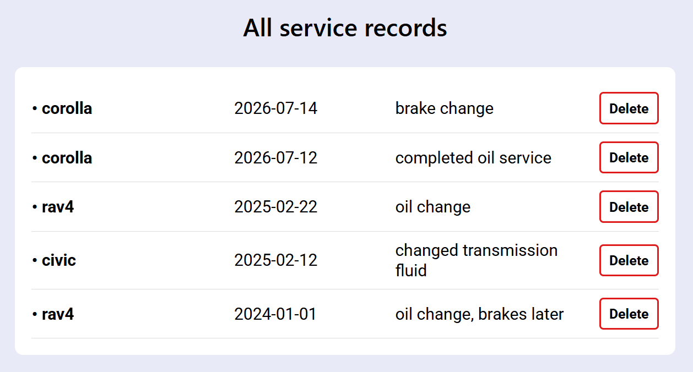

# Car Maintenance Log

A simple car maintenance tracker built with React and Supabase.

Users can add, view, and delete vehicle service records, with maintenance data stored in a Supabase database.

## Features

- Add vehicle, service details, and date
- View all maintenance records
- Delete service records
- Records sorted by date

## What I Learned

- Connecting React to Supabase
- Working with a PostgreSQL database
- Fetching, inserting, and deleting database records
- Managing application state with React
- Using async/await for database operations

## To-Do

- [ ] Improve mobile responsiveness
- [ ] Add filtering by vehicle and service type
- [ ] Add preset vehicle options
- [ ] Add user authentication and login
- [ ] Associate maintenance records with individual users
- [ ] Add editing for existing service records

## Screenshots

### Adding a Service

### Service Records

## Live Demo

[View Website](https://carcarelog.mahernama410.workers.dev/)
